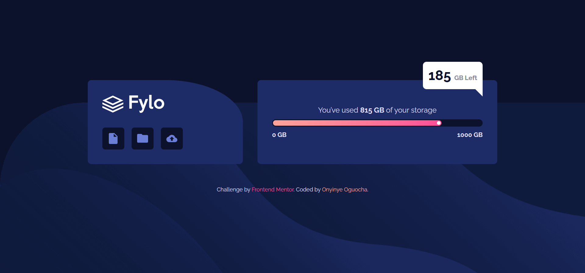
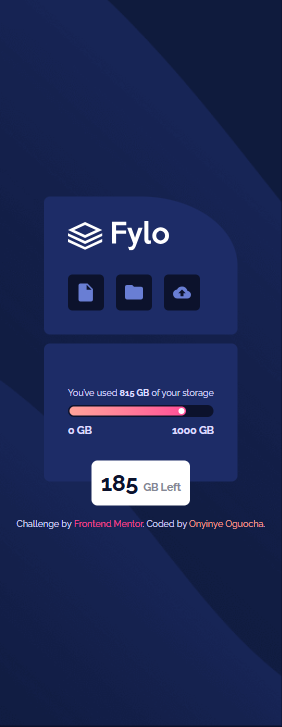

# Frontend Mentor - Fylo data storage component solution

This is a solution to the [Fylo data storage component challenge on Frontend Mentor](https://www.frontendmentor.io/challenges/fylo-data-storage-component-1dZPRbV5n). Frontend Mentor challenges help you improve your coding skills by building realistic projects. 

## Table of contents

- [Overview](#overview)
  - [The challenge](#the-challenge)
  - [Screenshot](#screenshot)
  - [Links](#links)
- [My process](#my-process)
  - [Built with](#built-with)
  - [What I learned](#what-i-learned)
  - [Continued development](#continued-development)
  - [Useful resources](#useful-resources)
- [Author](#author)
- [Acknowledgments](#acknowledgments)


## Overview

### The challenge

Users should be able to:

- View the optimal layout for the site depending on their device's screen size

### Screenshot





### Links

- Solution URL: [Github Repo](https://github.com/stephany247/fylo-data-storage-component-master)
- Live Site URL: [Live Demo](https://fylo-data-storage-component-master-opal-eight.vercel.app/)

## My process

### Built with

- Semantic HTML5 markup
- CSS custom properties
- Flexbox
- CSS Grid
- Mobile-first workflow
- [Tailwind CSS](https://tailwindcss.com/docs/installation) - For styles


### What I learned

While working on this project, I deepened my understanding of Tailwind CSS, particularly in handling background images, responsive layouts, and utility-first styling. Below are some key takeaways:

1. Positioning Without absolute: Rather than relying on absolute positioning, I used flexbox and grid for better layout control. For example, centering elements was done using:

```html
<div class="flex flex-col items-center justify-center min-h-screen gap-4"></div>

```

2. Creating a Triangle Shape with Tailwind
Instead of custom CSS, I used Tailwind’s border utilities to create a small triangle:
```html
<div class="hidden md:block absolute top-2 right-8 border-l-28 border-l-transparent border-t-28 border-t-white"></div>
```
3. Gradient Progress Bar Without absolute
I implemented a gradient progress bar without using absolute positioning, ensuring a clean layout:

```html
<div class="w-4/5 h-2 ml-[3px] rounded-full bg-gradient-to-r from-[hsl(6,100%,80%)] to-[hsl(335,100%,65%)]">
  <div class="size-2 bg-white rounded-full ml-auto"></div>
</div>
```


### Continued development

As I continue refining my frontend skills, there are a few key areas I want to focus on in future projects:

- Improving Accessibility (a11y) in UI Design
I want to ensure my projects are as accessible as possible by using semantic HTML alongside Tailwind’s accessibility utilities.
Testing designs with screen readers and improving keyboard navigation.

- Working with Tailwind and PostCSS
For future projects, I’d like to integrate PostCSS with Tailwind to optimize styles and improve performance. Explore custom configurations beyond the default Tailwind setup.

- Building More Dynamic UI Components
I also plan to:
- Experiment with Tailwind + JavaScript for interactive elements.
- Try DaisyUI or other Tailwind component libraries to speed up development.

By focusing on these areas, I aim to write cleaner, more efficient code and build more polished frontend projects. 🚀


### Useful resources

### Useful resources

- [Tailwind CSS Documentation](https://tailwindcss.com/docs) - Official Tailwind CSS documentation.
- [MDN Web Docs](https://developer.mozilla.org/en-US/) - Comprehensive resource for web development documentation.


## Author

- Website - [Onyinye Stephanie Oguocha](https://www.your-site.com)
- Frontend Mentor - [stephany247](https://www.frontendmentor.io/profile/stephany247)
- Twitter - [@stephanyoguocha](https://x.com/stephanyoguocha)

## Acknowledgments

A huge shoutout to Frontend Mentor for providing this challenge — it was a great opportunity to refine my Tailwind CSS skills and work on responsive design!

Also, special thanks to MDN Web Docs, CSS Tricks, and the Tailwind CSS documentation for helping me troubleshoot styling issues and optimize my layout.

Lastly, a big thanks to ChatGPT (aka Zunomiq 😆) for assisting with ideas, debugging, and refining my approach throughout the project! 🚀
